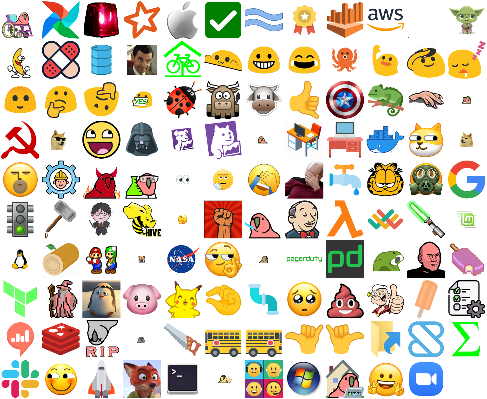

# slack-custom-emojis

Must-have Slack custom emojis for day to day slacking with your coworkers.

We need them because:

* They express emotions better than plain text.
* They all have transparent background.
* They look good.
